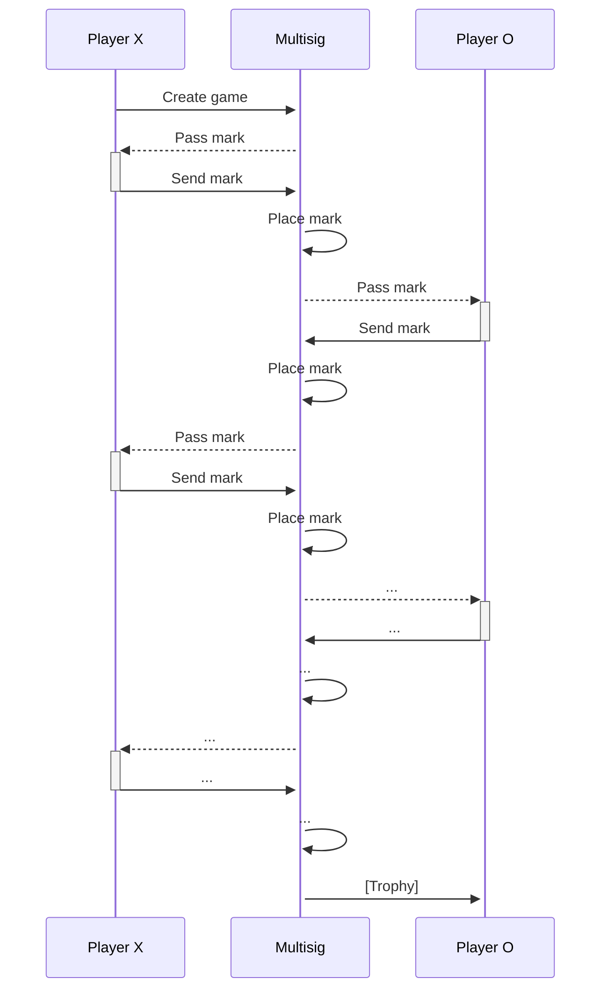

# Multisig Tic Tac Toe

See also https://github.com/MystenLabs/sui/blob/main/crates/sui-sdk/examples/tic_tac_toe.rs and
https://github.com/MystenLabs/sui/blob/main/sui_programmability/examples/games/sources/shared_tic_tac_toe.move

Instead of sharing the game-board, it belongs to the multi-sig account of the two players

This pattern uses a multi-sig account which holds some information that should be accessible from multiple accounts instead of a shared-object.
Tic tac toe has also been implemented using a shared-object for gameboard, or by passing the whole gameboard between two players.

This solution does not use shared-objects, but instead has the gameboard in a multisig 1 out of 2 account.
The Mark is passed between the game players.

A potential application of this pattern is the case when we want an object to be used asynchronously between two to ten accounts.



## Pros & Cons of pattern

| In respect to shared-object | In respect to game-admin |
| --- | --- |
| ~~+ Ability to delete object after game finished~~ | + No need for a third entity |
| + No order consensus needed | |
| - Care should be taken to prevent equivocation | - Care should be taken to prevent equivocation |
| - Way more complicated contract | - More complicated contract |
| - More complicated client integration | - More complicated client integration |
| - More transactions per action |  |
| - Max 10 users |  |

### Directories structure

- contract:
    - Contains the Move code of the smart contract

- tic-tac-toe_client:
    - Rust client 

- setup: Taken from https://github.com/MystenLabs/poc-template
    - A Typescript project, with ready-to-use:
        - environment variable (.env) file reading
        - Sui SDK integration
        - publish shell script

## Try it out:

setup/publish.sh uses environment variables `$USER1_ADDRESS` and `$USER3_ADDRESS` for players X and O.
```bash
./publish.sh [local]
```

Run the game in separate terminals:
```bash
cargo run -- --player x
```
```bash
cargo run -- --player o
```

